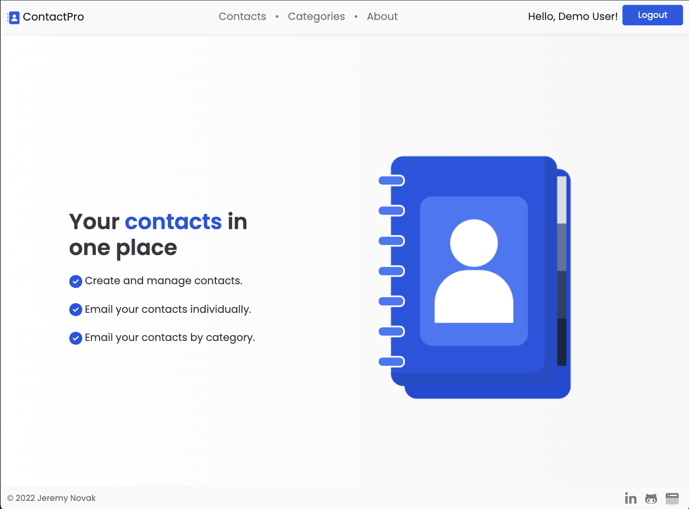
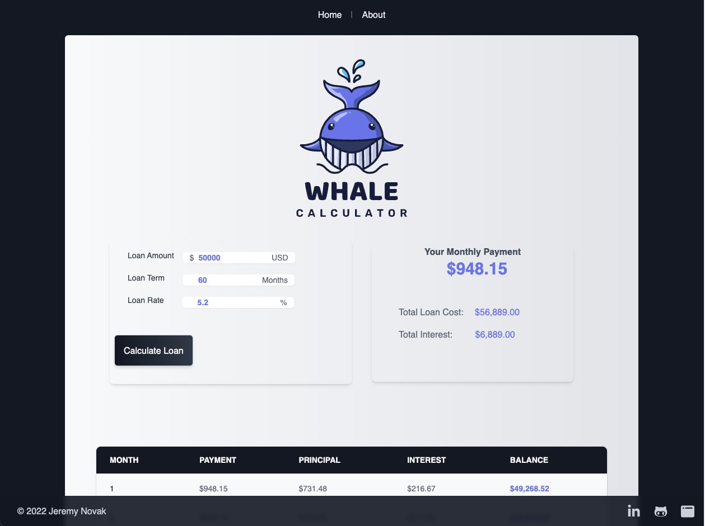

# 👋 Howdy there, I'm Jeremy Novak

## 👨‍🚀 About:

Building Software that solves a problem is my dream job.

I love to learn something new and use my skills to build cool things. As a Maker personality type, I am happiest when building and improving things that solve a problem or do something useful. Today I'm a Full Stack Web Developer and have created several projects that I invite you to explore and ask me questions if you have them. These projects demonstrate the type of skills that I have and the quality of work I will bring to your project.

In addition to my skills, I abide by three core tenants that I bring to any company, contract or freelance opportunity.

Work Ethic: Productivity is essential to me, and I'm always looking for ways to improve my workflow to accomplish more. A good day is a very productive day. 

Empathy: I endeavor to understand the needs of the business and put myself in the stakeholders' shoes. Then I leverage my skills as an engineer to produce the best solution for the project.

Love of the Craft: I'm committed to learning the best techniques and practices and improving my skillset to bring the most value to every project.

I'm always adding new skills, techniques, and best practices to my toolkit. Please reach out if you would like to connect.

C#, ASP.NET MVC, ASP.NET Web API, Entity Framework, Vue, JavaScript, HTML, CSS, Azure, Linux, Docker

Away from keyboard I am a 🐴 horseman 🏇, amateur :meat_on_bone: BBQ :fried_shrimp: cook, and enjoy being outdoors with my family and animals. 

## 🎨️ Recent Projects:

## ContactPro

A multi-tenant contact management application made with [ASP.NET MVC](https://dotnet.microsoft.com/en-us/apps/aspnet), [Azure SQL](https://azure.microsoft.com/en-us/products/azure-sql/), [MailGun](https://mailgun.com), [Bootstrap](https://getbootstrap.com), and deployed to [Azure](https://azure.microsoft.com/en-us) with [GitHub Actions](https://github.com/features/actions).
Create contacts and assign them to categories. Email your contacts individually or send email to all contacts in a category. Supports login with Google, Microsoft or Facebook accounts in addition to local accounts.

### Loan Calculator

A loan calculator made with [ASP.NET Web API](https://dotnet.microsoft.com/en-us/apps/aspnet/apis), [Vue3](https://vuejs.org/) and [TailwindCSS](https://tailwindcss.com/). Deployed to [Azure](https://azure.microsoft.com/en-us/) with [GitHub Actions](https://github.com/features/actions).

## 💼 Portfolio:

You can find my portfolio at [jgnovak.dev](https://jgnovak.dev)
